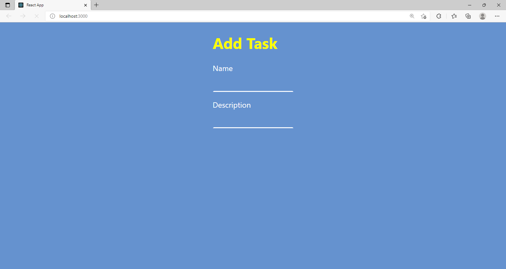
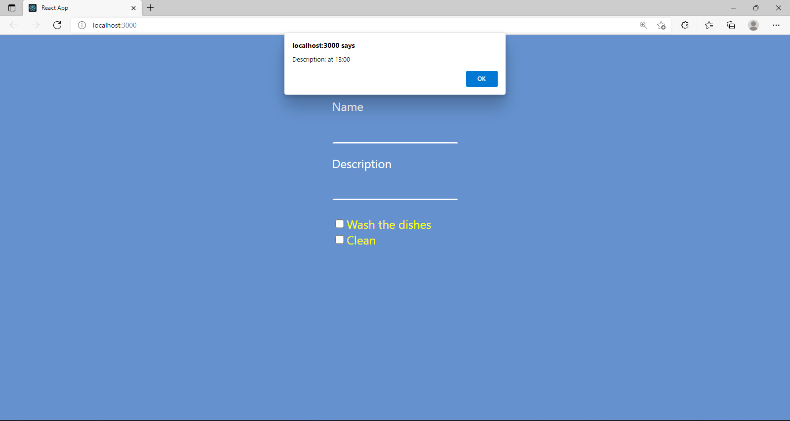
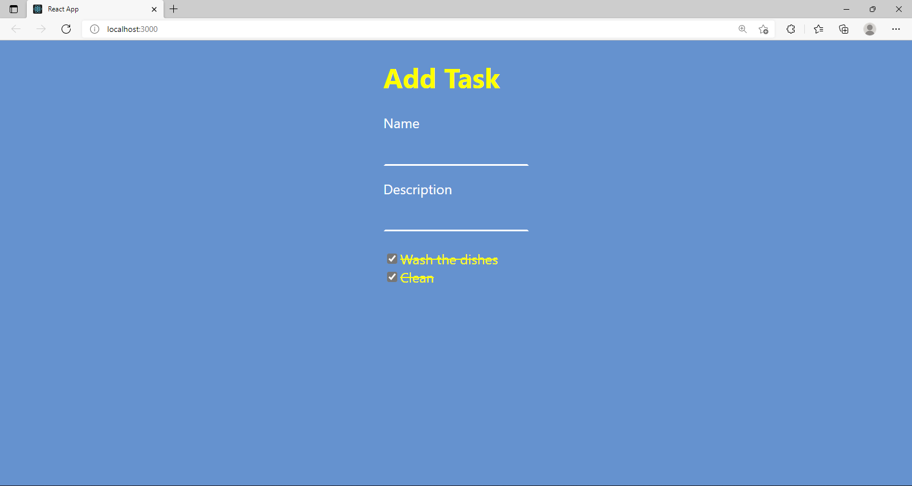

# To Do List

Este projeto tem como objetivo colocar em pratica os conhecimentos adquirido através do curso de react do academind
  
Adicionando uma nova tarefa
    
Mostrando a descrição após o click
    
Finalizando a tarefa
    

